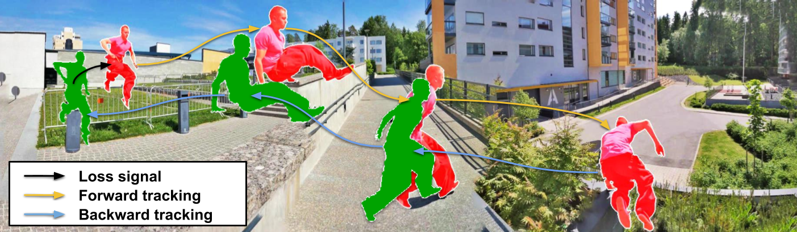
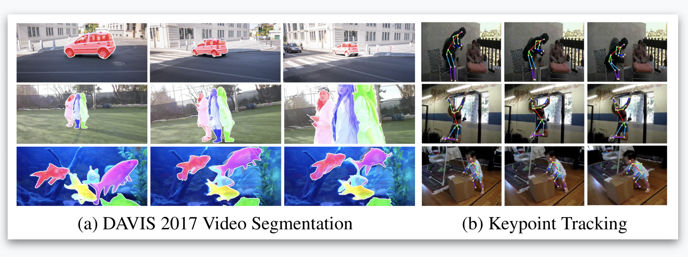
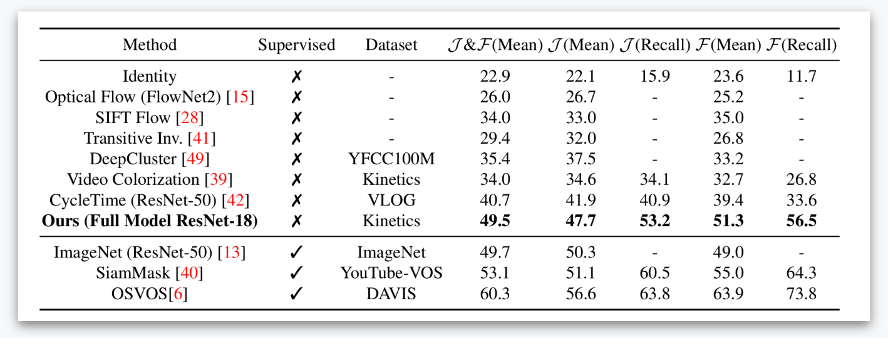

# Self-supervised Learning for Video Correspondence Flow

This repository contains the code (in PyTorch) for the model introduced in the following paper

[Self-supervised Learning for Video Correspondence Flow](https://arxiv.org/abs/1905.00875) (BMVC Oral representation)

by Zihang Lai, Weidi Xie



### Citation
```
@inproceedings{Lai19,
  title={Self-supervised Learning for Video Correspondence Flow},
  author={Lai, Z. and Xie, W.},
  booktitle={BMVC},
  year={2019}
}
```

## Contents

1. [Introduction](#introduction)
2. [Usage](#usage)
3. [Results](#results)
4. [Contacts](#contacts)

## Introduction

The objective of this paper is self-supervised learning of feature embeddings from videos, 
suitable for correspondence flow, i.e. matching correspondences between frames over the video. We leverage the natural spatial-temporal coherence of appearance in videos, to create a pointer model that learns to reconstruct a target frame by copying colors from a reference frame.

We make three contributions:
_First_, we introduce a simple information bottleneck that enforces the model to learn robust features for correspondence matching, and avoids it learning trivial solutions, e.g. matching based on low-level color information.
_Second_, we propose to train the model over a long temporal window in videos. To make the model more robust to complex object deformation, occlusion, the problem of tracker drifting,
we formulate a recursive model, trained with scheduled sampling and cycle consistency.
_Third_, we evaluate the approach by first training on the Kinetics dataset using self-supervised learning, and then directly applied for DAVIS video segmentation and JHMDB keypoint tracking.
On both tasks, our approach has achieved state-of-the-art performance, especially on segmentation, we outperform all previous methods by a significant margin.


## Usage
1. Install dependencies
2. Download Kinetics datasets. The videos should be decoded in files organized in the following way.
    ```
    ROOT_FOLDER/
    
        class_label_1/
            video_label_1/
                image_00001.jpg
                image_00002.jpg
                ...
            video_label_2/
           
        class_label_2/
            video_label_1/
            ...

        class_label_3/
            video_label_1/
            ...
        ...
        
    ```
    We use a csv file (functional/feeder/dataset/filelist.csv) for easier image indexing. Available Youtube videos in the Kinetics dataset may have changed at this time. So you may need to generate your own index file. It is easy to do so, just loop over all classes and all videos, record their relative path and the cooresponding frame number. 
3. Download DAVIS-2017 dataset. There is no need of pre-processing.
### Dependencies

- [Python3.5](https://www.python.org/downloads/)
- [PyTorch(1.0.0)](http://pytorch.org)
- [Pytorch Correlation module](https://github.com/ClementPinard/Pytorch-Correlation-extension)
- CUDA 9.0/9.2
- [Kinetics dataset](https://deepmind.com/research/open-source/open-source-datasets/kinetics/)
- [OxUvA dataset](https://oxuva.github.io/long-term-tracking-benchmark/)
- [DAVIS-2017](https://davischallenge.org/davis2017/code.html)
- [JHMDB](http://jhmdb.is.tue.mpg.de/challenge/JHMDB/datasets)

### Train
- Use the following command to train on Kinetics dataset
    ```
    python main.py --datapath path-to-kinetics --savepath log-path
    ```

- Recently, we also find the [OxUvA long-term tracking dataset](https://oxuva.github.io/long-term-tracking-benchmark/) yields comparable results. If you find the Kinetics dataset too large or not accessible, you can start with the OxUvA dataset, which is significantly smaller. Train our model on OxUvA with the following command
    ``` 
    python main_oxuva.py --datapath path-to-oxuva --savepath log-path
    ```

- To use OxUvA dataset, you just need to extract all sequences of frames (both training and validation) into the same folder. There should be 337 sequences in total.
    ```
    ROOT_FOLDER/
    
        vid0000/
            000000.jpeg
            000001.jpeg
            ...
           
        vid0001/
        ...
        vid0336/
        
    ``` 


### Test and evaluation
- Use the following command to test our model on DAVIS-2017 validation dataset for preliminary result (Note: this code may produce slightly different results from official DAVIS benchmark evaluation code) 
     ``` 
    python test.py --resume path-to-checkpoint \
                    --datapath path-to-davis \
                    --savepath log-path
    ```

- Use the following command to generate output for official DAVIS testing code
     ``` 
    python benchmark.py --resume path-to-checkpoint \
                    --datapath path-to-davis \
                    --savepath log-path
    ```

- Then you can test the output with the official Python evaluation code.
    ```
    python evaluation_method.py \
                    --task semi-supervised \
                    --results_path log-path
    ```
### Pretrained model (No need to extract the file)
| Trained on Kinetics | Trained on OxUvA (updated) |
|---|---|
|[Google drive](https://drive.google.com/open?id=1lONshAVbqm8JWYCeWW7hdim1H2e-9tnI)|[Google drive](https://drive.google.com/open?id=1hBufOBoKmHWWKy2-BJObMbYrqDAUJrs7)|

### Todo
- Release JHMDB testing code
- Release larger models with higher accuracy

## Results
 
 
### Preliminary results on OxUvA

| Dataset | J&F (mean) | J (Mean) | J (Recall) | F (Mean) | F (Recall) |
|---|---|---|---|---|---|
| OxUvA| 50.3 | 48.4 | 53.2 | 52.2 | 56.0 | 
